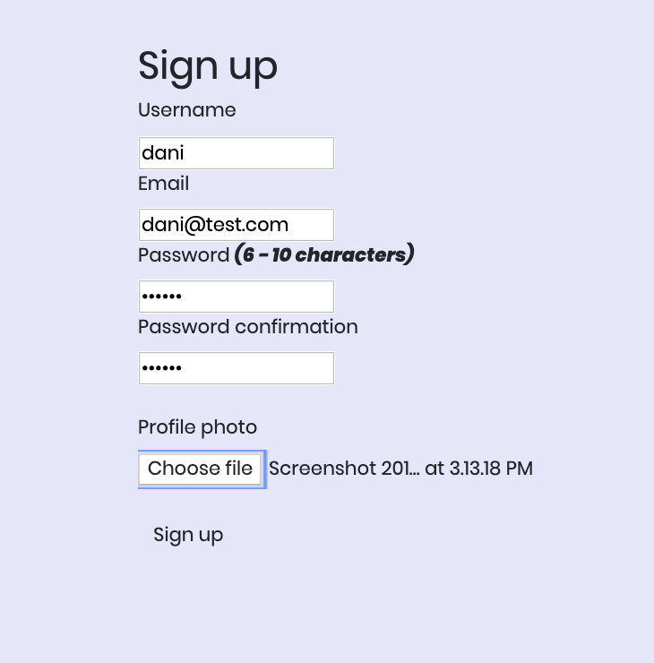
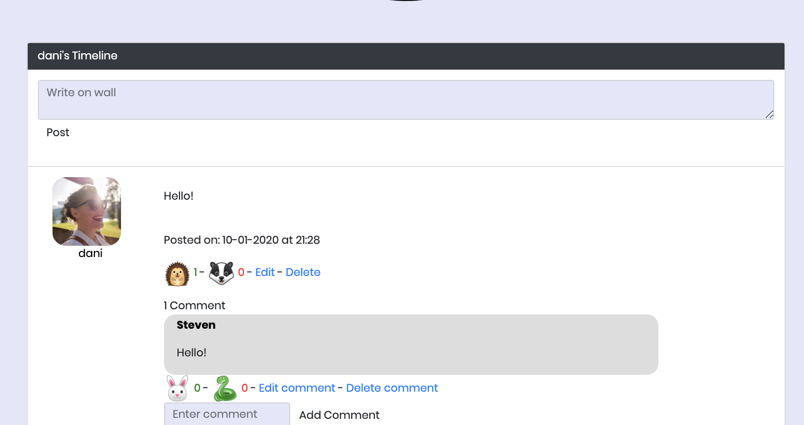
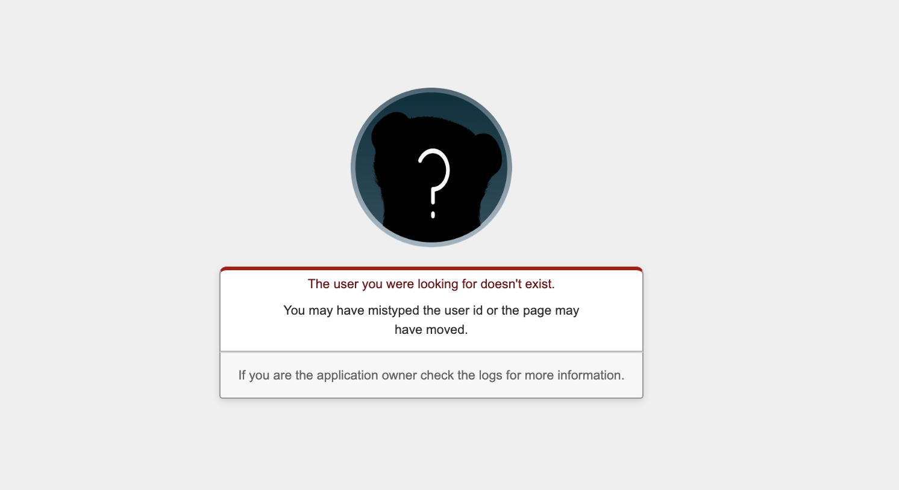

[](https://travis-ci.org/Yasmineral/acebook-short-ferret-midnight)
[](https://www.codacy.com/manual/Yasmineral/acebook-short-ferret-midnight?utm_source=github.com&amp;utm_medium=referral&amp;utm_content=Yasmineral/acebook-short-ferret-midnight&amp;utm_campaign=Badge_Grade)

## Project Outline
Team Short Ferret Midnight consisted of:
- [Yas Kemp](https://github.com/Yasmineral)
- [Nathan Hynes](https://github.com/NathanHynes)
- [Jess Marais](https://github.com/jessmar94)
- [Brad Phillips](https://github.com/bradjp)
- [Danielle Inkster](https://github.com/danielleinkster)
- [Jay Issuree](https://github.com/jayissuree)

The goal of the two-week project is to use high-quality processes to build a project in a team.

[You can find the engineering project outline here.](https://github.com/makersacademy/course/tree/master/engineering_projects/rails)

## Live Web App
Click [here](https://salty-peak-83707.herokuapp.com/) to visit our Acebook app.

## Trello
[Link to our Trello board](https://trello.com/b/vN4cu4v1/short-ferret-midnight)

## Documented Learning
[View our daily blog posts here](https://medium.com/@shortferretmignight)

## User Stories
As a user,
So I can be trendy and cool,
I want to sign up to Acebook with a unique email, username and password.

As a user,
So I can continue using Acebook,
I want to be able to login and logout.

As a user,
So that I can protect my privacy,
I only want other Acebook users to be able to see posts.

As a user,
So I can keep up to date with my ferret friends,
I want to view all posts made on Acebook.

As a user,
So I can share my favourite ferret jokes,
I want to be able to make a post on Acebook and the post is dated.

As a user,
So I can judge my ferret friends harshly,
I want to be able to add a comment on and like or dislike a post/comment.

As a user,
So I can remove or improve some of my terrible ferret jokes,
I want to be able to edit and delete a post or comment that I made.

As a user,
So I can compare myself with my friends,
I want to have my own wall and be able to visit other users' walls.

As a user,
So I know if the user id doesn't exist,
I want to be routed to a 404 Error page if the user doesn't exist.

## Technologies
* Rails 5.2
* PostgreSQL(ActiveRecord)
* Bcrypt
* Devise
* Travis
* Rubocop
* SimpleCov

## How to Install and Run
```bash
> git clone https://github.com/Yasmineral/acebook-short-ferret-midnight.git
> bundle install
> rake db:create  
> rake db:migrate

> bin/rails server # Start the server at localhost:3000
```
## How to Run Tests
```bash
> rspec # Run the tests to ensure it works
> rubocop # Check code quality
```
## Feature Test
### Create a New User


### Make and Like Posts


### Error Message


## Reflection
This project introduced a lot of concepts I was previously unfamiliar with. In terms of tech, I learned a lot about the benefits of using Rails to build a website. It was a bit overwhelming at first as so many things appear when you first generate a project, not to mention how many objects and methods are already inherent. It was a steep learning curve to say the least, but by the end of the project I felt comfortable working with the framework. Additionally, I learned about a lot of really useful gems that could be incorporated into future projects, such as Devise which helps generate controllers to create a new user as well as control the sessions (login/out, etc.)

This project also taught me a lot about the benifits of working with Agile practices. For example, in this project we worked off tickets(small tasks based off user stories) from a Trello board and made estimations for times of completion. Tickets were assigned to a pair and worked through until finished; this helped us to work efficiently to avoid overlap and wasted time.. We also worked in two day sprints to maintain motivation and accountabilty and gave us the opportunity to revise our goals at the end of each sprint as needed. Our team used daily standups and retros to communicate the progress each pair made as well as any issues that needed to be addressed. While it was difficult to stay mindful of some of these practices at first, once they were incorporated, they were incredibly useful to make our team more effective and efficient.

Finally, this project taught me a lot about the principles of RESTful design. Again, there was a steep learning curve into how it has been, in part, built in to the Rails framework. While I had previous experience with the HTTP verbs (GET, PUT. POST, DELETE, etc) it took a while to figure out exactly how the methods Rails builds into the controllers work to create, manipulate or delete a resource. I have continued to research the principles of REST following this project in order to improve my understanding.

